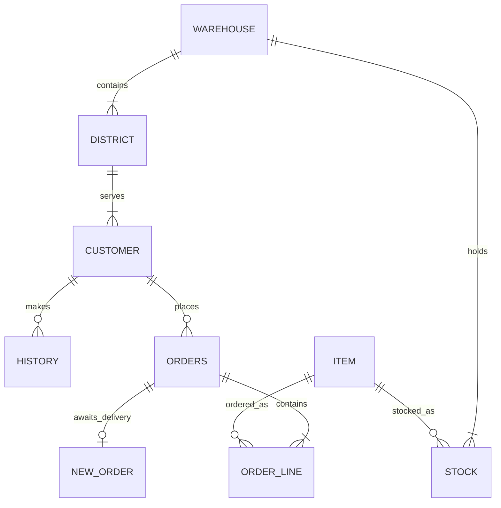

# TPC-C Benchmark Schema and Workload

This benchmark models the nine-table TPC-C schema and the five standard TPC-C
transaction types. `pgbench` acts as the terminal driver, while PL/pgSQL
functions on the coordinator execute the individual SQL statements.

This is a TPC-C-style performance workload, not an audited TPC-C
implementation or published TPC-C result.

## Citus layout

Eight tables are distributed by warehouse ID and automatically colocated
because they use compatible distribution keys and the same shard count.
Transactions confined to one warehouse therefore route to one shard. `item`
is a reference table because its 100,000 products are shared by every
warehouse.

| Table | Distribution key | Role |
| --- | --- | --- |
| `warehouse` | `w_id` | One row for each warehouse |
| `district` | `d_w_id` | Ten sales districts in each warehouse |
| `customer` | `c_w_id` | Customers belonging to a warehouse and district |
| `history` | `h_w_id` | Append-only payment history |
| `new_order` | `no_w_id` | Queue of orders awaiting delivery |
| `orders` | `o_w_id` | Order headers |
| `order_line` | `ol_w_id` | Items belonging to orders |
| `stock` | `s_w_id` | Per-warehouse inventory for every item |
| `item` | Reference table | Shared product catalog |

The stored functions are intentionally not registered with
`create_distributed_function()`. They run on the coordinator, so Citus plans
and routes each inner statement independently. This exercises coordinator
router planning, fast-path execution, and worker prepared-statement behavior.

## Relationships

The schema expresses relationships through composite identifiers rather than
foreign-key constraints:



The principal identifiers are:

| Entity | Identifier |
| --- | --- |
| Warehouse | `w_id` |
| District | `(d_w_id, d_id)` |
| Customer | `(c_w_id, c_d_id, c_id)` |
| Order | `(o_w_id, o_d_id, o_id)` |
| Order line | `(ol_w_id, ol_d_id, ol_o_id, ol_number)` |
| Stock row | `(s_w_id, s_i_id)` |
| Item | `i_id` |

Two secondary indexes support customer-name and latest-order lookups:

- `customer_last_idx (c_w_id, c_d_id, c_last, c_first)`
- `orders_cust_idx (o_w_id, o_d_id, o_c_id, o_id)`

## Initial data volume

The item loader creates 100,000 warehouse-independent `item` rows. For every
warehouse, the warehouse loader creates:

| Table | Rows per warehouse |
| --- | ---: |
| `warehouse` | 1 |
| `district` | 10 |
| `stock` | 100,000 |
| `customer` | 30,000 |
| `history` | 30,000 |
| `orders` | 30,000 |
| `new_order` | 9,000 |
| `order_line` | Approximately 300,000 |

Each district starts with 3,000 customers and 3,000 orders. Orders 2101
through 3000 initially have no carrier and appear in `new_order`. Each order
contains between 5 and 15 order lines.

## Workload mix

The runner passes five weighted scripts to `pgbench`:

| Transaction | Weight | Function |
| --- | ---: | --- |
| New-Order | 45% | `tpcc.neword(...)` |
| Payment | 43% | `tpcc.payment(...)` |
| Order-Status | 4% | `tpcc.ostat(...)` |
| Delivery | 4% | `tpcc.delivery(...)` |
| Stock-Level | 4% | `tpcc.slev(...)` |

Each pgbench client is pinned to a home warehouse using its client ID. The
district, customer, item, quantity, and other transaction inputs vary per
call. Customer and item identifiers use non-uniform random generation to
approximate TPC-C access skew.

By default pgbench uses the `prepared` protocol. It prepares the outer
function call in each script; the PL/pgSQL function then issues the SQL
statements described below.

## New-Order

New-Order creates one order with 5 to 15 lines.

1. Read the customer discount and identity together with the warehouse tax.
2. Lock the district row and read its next order ID and tax.
3. Increment the district's next order ID.
4. Insert a row into `new_order`.
5. For each order line, read the reference-table item and lock its stock row.
6. Update stock quantity, year-to-date quantity, order count, and remote count.
7. Insert the calculated line amount into `order_line`.
8. Insert the order header into `orders`.

One percent of order lines select stock from another warehouse when multiple
warehouses exist. Those lines are multi-shard transactions; all other lines
use stock colocated with the order's home warehouse.

## Payment

Payment records a customer payment and updates accounting totals.

1. Update and read the home warehouse's year-to-date total and name.
2. Update and read the home district's year-to-date total and name.
3. Select the customer by ID, or in 60% of calls find the middle customer when
   matching customers are sorted by first name.
4. Lock the customer and read its credit status and balance.
5. Update the balance, payment total, and payment count. For bad-credit
   customers, also prepend transaction details to `c_data`.
6. Append a row to `history`.

Fifteen percent of calls pay for a customer belonging to another warehouse.

## Order-Status

Order-Status is read-only.

1. Select the customer by ID or, in 60% of calls, by the middle matching last
   name as in Payment.
2. Read the customer's balance.
3. Find that customer's highest order ID.
4. Count the order's lines when an order exists.

## Delivery

Delivery processes the oldest undelivered order in each of a warehouse's ten
districts.

For each district it finds the lowest order ID in `new_order`, then:

1. Delete the queue entry.
2. Read the customer ID from the order header.
3. Assign the requested carrier to the order.
4. Set the delivery timestamp on every order line.
5. Sum the order-line amounts.
6. Add the total to the customer's balance and increment its delivery count.

Districts with no queued order are skipped.

## Stock-Level

Stock-Level is a read-only, colocated single-shard join.

1. Read the district's next order ID.
2. Examine order lines from the preceding 20 orders.
3. Join those lines to warehouse stock by item ID.
4. Count distinct items whose stock quantity is below a random threshold from
   10 through 20.

## Running the benchmark

### Prerequisites

Run the driver from a host with Bash, `psql`, `pgbench`, Python 3, and GNU
`xargs`. For performance measurements, use a driver host separate from the
database nodes so client-side CPU does not compete with PostgreSQL. The target
database must have Citus installed and must expose
`citus.enable_prepared_statement_caching`.

The runner uses the standard libpq environment variables for data loading,
maintenance, diagnostics, and every `pgbench` connection. DDL sessions are
always sent to the coordinator on port `5432`, including schema resets,
distribution calls, function creation, and `--worker-plan-cache-mode`.
For example, to use an Elastic Cluster load-balancer endpoint for benchmark
traffic:

```bash
export PGHOST=cluster.example.com
export PGPORT=7432
export PGUSER=citus
export PGDATABASE=citus
export PGSSLMODE=require
```

Use `.pgpass` or another normal libpq mechanism for credentials. Verify the
target before loading data:

```bash
psql -X -c 'SELECT version(), current_database()'
```

Commands below assume the repository root is the current directory.

### Build and run

Build the schema and initial data set, then run a comparison:

```bash
bench/tpcc/run_tpcc.sh \
   --build \
   --warehouses 100 \
   --shards 32 \
   --jobs 16 \
   --clients 1,8,32,64 \
   --duration 300 \
   --iterations 5 \
   --warmup 30 \
   --modes off,both \
   --label ec4
```

`--build` is destructive: it drops and recreates the `tpcc` schema before
loading the item catalog and warehouse data. It does not stop after loading;
the same invocation continues into the benchmark with the requested client,
duration, iteration, and mode settings. There is currently no build-only
option. Without overrides, build mode creates 10 warehouses across 32 shards
using 8 loader jobs.

When either `--reload` or `--reset-between-modes` is present, `--build` is not
needed, even on an empty database. Both reset modes drop any existing `tpcc`
schema and load a fresh baseline at startup. The startup baseline is reused by
the first iteration or mode, avoiding an immediate duplicate rebuild.

After the data set exists, run another measurement without rebuilding it:

```bash
bench/tpcc/run_tpcc.sh \
   --clients 1,8,32,64 \
   --duration 300 \
   --iterations 5 \
   --warmup 30 \
   --modes off,both \
   --label rerun
```

For a controlled feature comparison, rebuild the deterministic baseline before
every mode, vacuum it, allow background work to settle, and collect diagnostics:

```bash
bench/tpcc/run_tpcc.sh \
   --clients 64 \
   --duration 300 \
   --iterations 5 \
   --warmup 30 \
   --modes off,both \
   --reset-between-modes \
   --vacuum-before-run \
   --cooldown 60 \
   --diagnostics \
   --label controlled
```

`--reset-between-modes` drops and recreates the `tpcc` schema before each
mode's warmup, starting with the baseline created at startup. The loaders use
fixed random seeds and a fixed initial timestamp, so the same warehouse count,
shard count, and loader-job count produce the same logical baseline. Both the
warmup and measured run may mutate the data, but the next mode starts over from
that baseline. This is the strongest comparison mode and is intentionally
expensive.

For a weaker reset, `--reload` builds the baseline at startup and rebuilds
before every subsequent iteration. Modes in the same iteration still run
against an evolving data set, although their order rotates between iterations
to reduce systematic bias. `--reload` and `--reset-between-modes` are mutually
exclusive.

`--vacuum-before-run` issues `VACUUM (ANALYZE)` after a reset and before the
warmup. It removes dead tuples left by any prior state and gives the planner
fresh statistics without taking the exclusive locks or rewriting tables as
`VACUUM FULL` would. A full vacuum is therefore deliberately not part of the
runner. `--cooldown` waits after reset, maintenance, and diagnostics but before
the warmup, allowing checkpoints and background maintenance to settle.

### Modes and protocol

The supported comparison modes are:

| Mode | Prepared-statement caching |
| --- | --- |
| `off` | `citus.enable_prepared_statement_caching=off` |
| `both` | `citus.enable_prepared_statement_caching=on` |

The runner defaults to `--modes off,both` and alternates their order across
iterations. The `part1` name is reserved for builds that separately control
the coordinator fast path, but this runner rejects it because that GUC is not
available in the current build.

The default `--protocol prepared` tells `pgbench` to prepare each outer
PL/pgSQL function call. `simple` and `extended` are also valid `pgbench` query
modes, but `prepared` is the intended mode for this feature comparison.

### Options

| Option | Default | Meaning |
| --- | --- | --- |
| `--build` | off | Recreate and load once when neither reset mode is used |
| `--warehouses N` | `10` | Warehouses to create during `--build` |
| `--shards N` | `32` | Shards to create during `--build` |
| `--jobs N` | `8` | Parallel warehouse loader processes |
| `--clients LIST` | `1,8,32` | Comma-separated `pgbench` client counts |
| `--duration SECONDS` | `60` | Measured duration of each run |
| `--iterations N` | `3` | Repetitions for each client count and mode |
| `--modes LIST` | `off,both` | Comma-separated feature modes |
| `--protocol MODE` | `prepared` | `pgbench` query mode |
| `--warmup SECONDS` | `30` | Unreported warmup before each measured run; `0` disables it |
| `--reload` | off | Rebuild at startup and before each subsequent iteration |
| `--reset-between-modes` | off | Rebuild at startup and before each subsequent mode |
| `--vacuum-before-run` | off | Run `VACUUM (ANALYZE)` before every mode's warmup |
| `--cooldown SECONDS` | `0` | Wait before every mode's warmup |
| `--diagnostics` | off | Capture diagnostics before warmup and after measurement |
| `--outdir PATH` | timestamped directory | Override the results directory |
| `--label TEXT` | empty | Append a label to the default results directory name |
| `--worker-plan-cache-mode MODE` | unchanged | Persistently set worker database `plan_cache_mode` before running |

`--worker-plan-cache-mode` runs `ALTER DATABASE` on every worker. Typical
values are `auto`, `force_generic_plan`, and `force_custom_plan`. The setting
persists after the benchmark and is not automatically restored.

### Results

By default, output is written to
`bench_results/tpcc_<timestamp>[_<label>]/`. The directory contains:

| File | Contents |
| --- | --- |
| `env.txt` | Target, topology, versions, and relevant PostgreSQL settings |
| `summary.csv` | TPS, average latency, and New-Order-per-minute for every measured run |
| `tpcc_c<clients>_<mode>_iter<n>.txt` | Raw `pgbench` output for one run |
| `report.txt` | Median results, iteration drift, variability, and comparisons against `off` |
| `diagnostics_c<clients>_<mode>_iter<n>_<phase>.txt` | Optional shard sizes, database counters, and per-node tuple statistics |
| `reset_c<clients>_<mode>_iter<n>.txt` | Loader output from an optional per-mode reset |

The script continues after an individual `pgbench` failure and prints the
corresponding raw-output path. Check the terminal output and the expected row
count in `summary.csv` before treating a report as complete. The iteration
drift section averages all complete modes within each iteration and reports
the first-to-last TPS change, making cumulative degradation visible despite
mode-order rotation.

## Source files

- `01_schema.sql` creates the schema, distributed tables, indexes, and data
  generation helpers.
- `02_load_items.sql` loads the shared item catalog.
- `02_load_warehouses.sql` loads warehouse-dependent data.
- `03_procs.sql` defines the five transaction functions.
- `scripts/*.sql` generates pgbench inputs and invokes those functions.
- `run_tpcc.sh` builds the data set and runs the weighted workload.